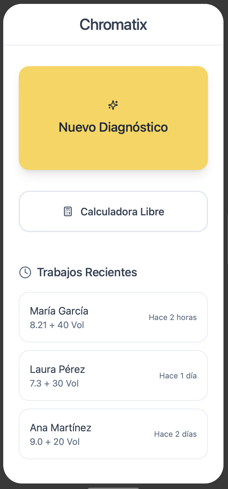

# 🌈 Chromatix: The Color OS

  

---
> **El primer sistema operativo de colorimetría profesional agnóstico.**

Chromatix es un asistente inteligente diseñado para eliminar el error humano en el salón. Transforma el diagnóstico visual en **algoritmos de precisión química**, optimizando el inventario y garantizando resultados 100% predecibles.

---

## 🚀 Propuesta de Valor (MVP)
- **Arquitectura Universal:** Motor lógico agnóstico capaz de procesar cualquier marca (Lanzamiento inicial: **Yellow Professional**).
- **Precisión Algorítmica:** Basado en el círculo cromático, fondos de aclaración reales y leyes de neutralización.
- **Eficiencia Operativa:** Cálculo automático de ratios de mezcla (gramajes exactos) y tiempos de exposición.
- **Seguridad Capilar:** Alertas automáticas de salud de la fibra y sugerencia de aditivos (Bond Hero/Scalp Protector).

## 🧠 El Engine (Core Logic)
El corazón de Chromatix reside en su lógica de intersección de datos:
1. **Input:** Nivel Inicial + Nivel Objetivo + % de Canas + Densidad/Largo.
2. **Proceso:** Cálculo de salto térmico -> Selección de Oxidante -> Identificación de Fondo Revelado -> Match de Reflejo Neutralizador.
3. **Output:** Fórmula exacta (ej. 45g 8.21 + 67.5ml 30 Vol) + Timer inteligente.

## 📁 Estructura del Repositorio

El proyecto sigue una arquitectura de **Separación de Concernimientos (SoC)**, donde la lógica de negocio es independiente de la estructura de datos.

- [🚀 **Technical Brief**](/docs/TECHNICAL_BRIEF.md): Documento maestro con las especificaciones de ingeniería, reglas del "Guardian" y lógica de negocio.
- [📋 **Client Schema**](/docs/CLIENT_SCHEMA.md): **Contrato de datos** que define la Ficha Clínica, el Feedback Loop y la Historia Capilar.
- [🧠 **Yellow Engine**](/src/data/Yellow_engine.json): **Matriz lógica de colorimetría para Yellow Professional.** Contiene ratios, tiempos y protocolos de seguridad específicos.
- [🗺️ **Roadmap 2026**](/docs/ROADMAP_2026.md): Plan de ejecución detallado desde el MVP local hasta la arquitectura Cloud con IA.

---
*Chromatix: De la intuición del colorista a la precisión del algoritmo.*
